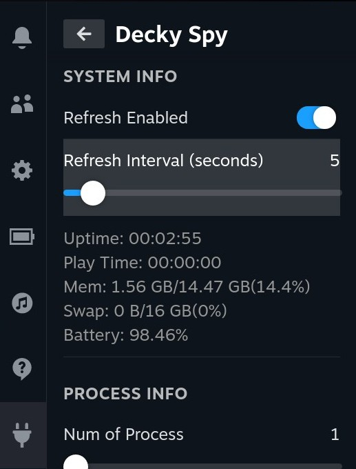
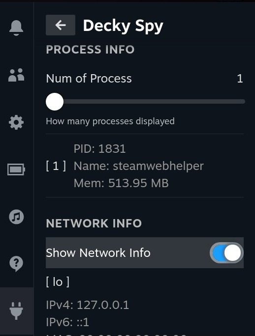
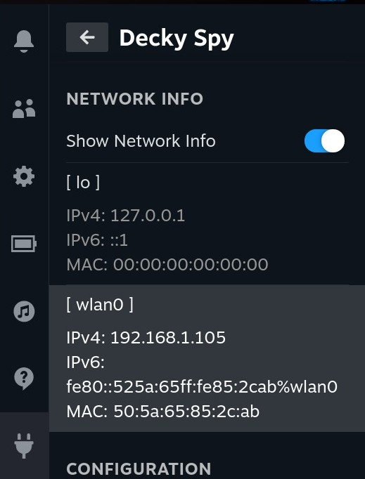
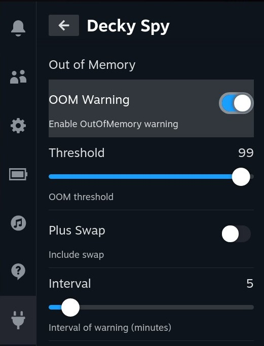
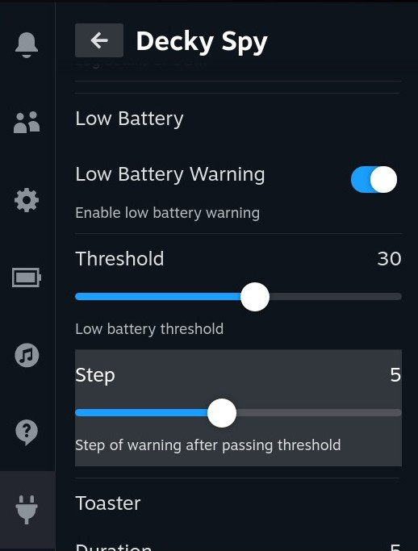
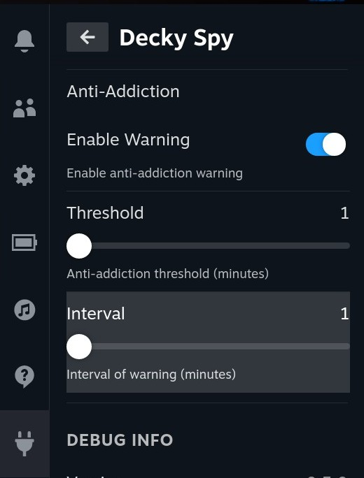

# Decky Spy

## Description

Decky Spy is a plugin to monitor memory and processes on your Steam Deck. It depends on DeckyLoader.

## Features

-   Monitor memory usage of processes, and warn when the memory usage is high.
-   Monitor battery level, and warn when the battery is low.
-   Remind you to take a break when you play games for a long time.

## Screenshots

### Info

### Out of Memory

### Low Battery

### Anti-Addiction

### Toaster

## Installation

Download the package from the latest release and install it.

## Debug

SSH to your Steam Deck and check the following files.

`/home/deck/homebrew/logs`
