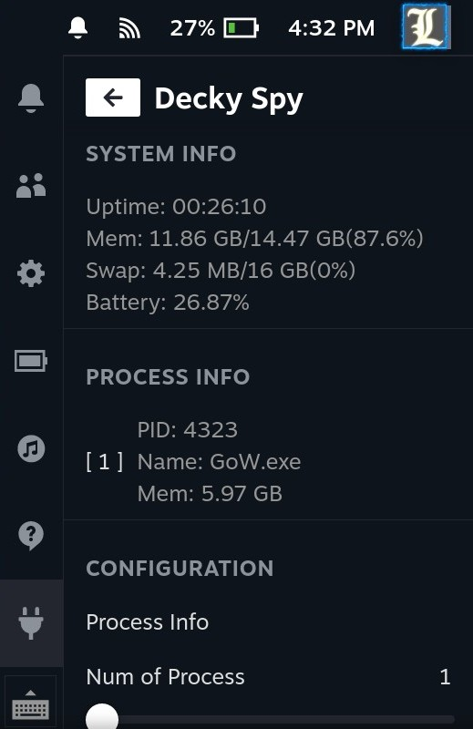
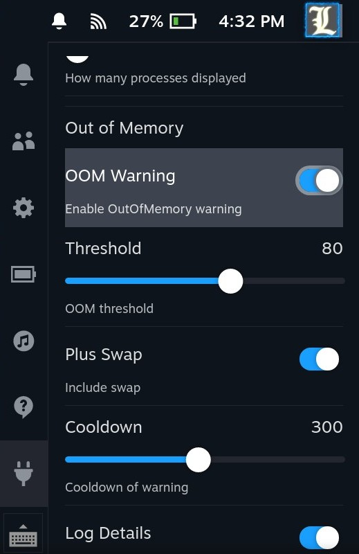
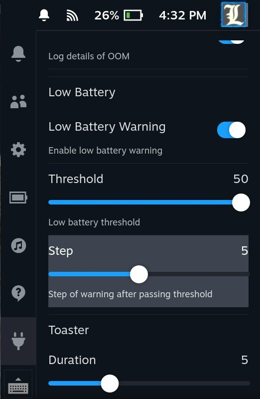
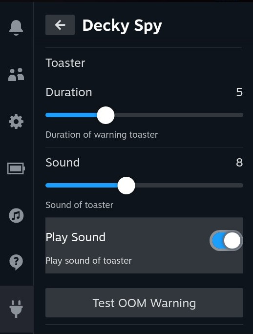

# Decky Spy

## Description

Decky Spy is a plugin to monitor memory and processes on your Steam Deck. It depends on DeckyLoader.

## Features

-   Monitor memory usage of processes, and warn when the memory usage is high.
-   Monitor battery level, and warn when the battery is low.

## Screenshots

### Info



### Out of Memory



### Low Battery



### Toaster



## Installation

1. Install [DeckyLoader](https://github.com/SteamDeckHomebrew/decky-loader).
2. Set up Python environment.

```
curl https://pyenv.run | bash
pyenv install -v 3.10.10
pyenv virtualenv 3.10.10 decky-spy
curl https://github.com/Seraphli/decky-spy/raw/main/requirements.txt | pip install -r /dev/stdin
```

3. Download the package from the latest release and install it.
